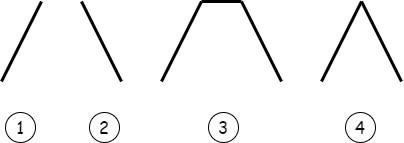

# [B. Optimal Reduction](https://codeforc.es/problemset/problem/1713/B)

=== "规律模拟"

    给你一个长度为 $n$ 的数组，你可以选择其中任意的连续区间 $[l, r]$，并且将该区间上的所有数减 $1$，假设你通过不断的执行这种操作后，最终将原数组全部置为 $0$ 所需要的最小操作为 $x$，询问你，若随机的打乱原数组，是否存在一个更小的 $x$ 呢？

    如果存在输出 $NO$，否则输出 $YES$.

    如果原数组是形如：

    

    就一定能保证 $x$ 是最小的，无论你怎么打乱原数组！

    思考一下，下方代码为何答案错误？

    !!! warning "思维误区"

        下方的代码是想判断数组 $a$ 是否存在向下凹的折点，出发点是没错的，但是只适用于左边的情形，不适合右边的情形：

        

        ```c++
        #include <bits/stdc++.h>

        using namespace std;
        typedef long long LL;
        typedef __int128_t HH;

        const LL N = 110000;

        LL n;
        LL a[N];

        void solve() {
            
            scanf ("%lld", &n);
            for (LL i = 1; i <= n; i ++) {
                scanf ("%lld", a + i);
            }

            a[0] = 0;
            a[n + 1] = 0;

            if (n == 1 || n == 2) {
                printf ("YES\n");
                return;
            }

            for (LL i = 2; i < n; i ++) {
                if (a[i - 1] > a[i] && a[i] < a[i + 1]) {
                    printf ("NO\n"); return;
                }
            }

            printf ("YES\n");
            
        }

        int main() {
            LL t; scanf ("%lld", &t);
            while (t --)
            solve();

            return 0;
        }
        ```

    稍微改造一下：

    直接求出等差数组，判断是否全正、全负，或者只有左边正、右边负。

    ```c++
    #include <bits/stdc++.h>

    using namespace std;
    typedef long long LL;
    typedef __int128_t HH;

    const LL N = 110000;

    LL n;
    LL a[N];
    LL b[N];

    void solve() {
        
        scanf ("%lld", &n);
        for (LL i = 1; i <= n; i ++) {
            scanf ("%lld", a + i);
            b[i] = a[i] - a[i - 1];
        }
        LL p = 0;
        for (LL i = 1; i <= n; i ++) {
            if (b[i] >= 0) p = i;
            else break;
        }
        for (LL i = p + 1; i <= n; i ++) {
            if (b[i] <= 0) p = i;
            else break;
        }

        if (p == n) puts("YES");
        else puts("NO");
    }

    int main() {

        LL t; scanf ("%lld", &t);
        while (t --)
        solve();

        return 0;
    }
    ```