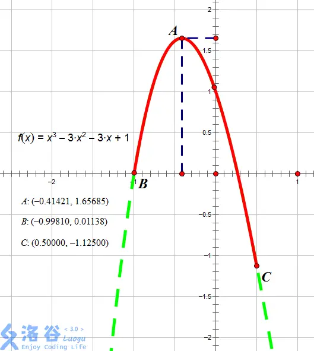
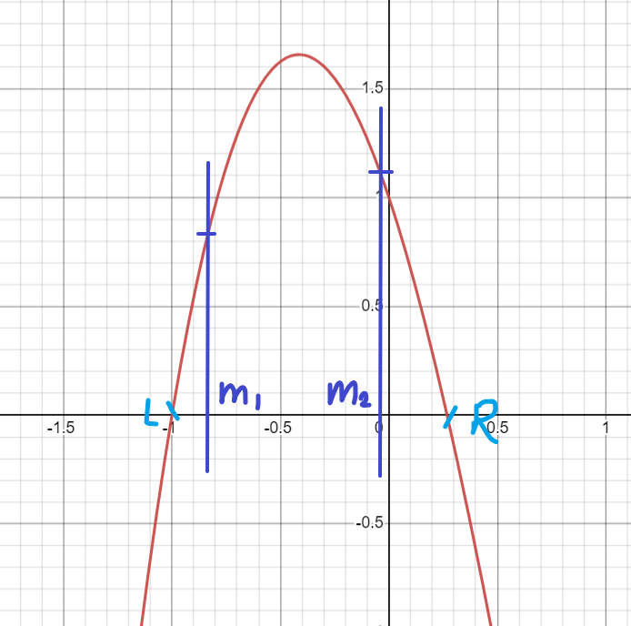

# 【模板】实数三分法

??? question "[问题描述](https://www.luogu.com.cn/problem/P3382)"

    # 【模板】实数三分法

    ## 题目描述

    如题，给出一个 $N$ 次函数，保证在范围 $[l, r]$ 内存在一点 $x$，使得 $[l, x]$ 上单调增，$[x, r]$ 上单调减。试求出 $x$ 的值。

    ## 输入格式

    第一行一次包含一个正整数 $N$ 和两个实数 $l, r$，含义如题目描述所示。

    第二行包含 $N + 1$ 个实数，从高到低依次表示该 $N$ 次函数各项的系数。

    ## 输出格式

    输出为一行，包含一个实数，即为 $x$ 的值。若你的答案与标准答案的相对或绝对误差不超过 $10^{-5}$ 则算正确。

    ## 样例 #1

    ### 样例输入 #1

    ```
    3 -0.9981 0.5
    1 -3 -3 1
    ```

    ### 样例输出 #1

    ```
    -0.41421
    ```

    ## 提示

    对于 $100\%$ 的数据，$6 \le N \le 13$，函数系数均在 $[-100,100]$ 内且至多 $15$ 位小数，$|l|,|r|\leq 10$ 且至多 $15$ 位小数。$l\leq r$。

    **【样例解释】**

     

    如图所示，红色段即为该函数 $f(x) = x^3 - 3 x^2 - 3x + 1$ 在区间 $[-0.9981, 0.5]$ 上的图像。

    当 $x = -0.41421$ 时图像位于最高点，故此时函数在 $[l, x]$ 上单调增，$[x, r]$ 上单调减，故 $x = -0.41421$，输出 $-0.41421$。

## 实数三分



对于向上凸的包：

如果 $f(m1) < f(m2)$ ，可以确定最高点一定在 $m1$ 的右侧，指针 $l$ 移动到 $m1$ 处;

如果 $f(m1) > f(m2)$ ，可以确定最高点一定在 $m2$ 的左侧，指针 $r$ 移动到 $m2$ 处;

如果 $f(m1) = f(m2)$ ，则最高点一定在 $m1$ 和 $m2$ 之间，指针 $l$ 和 $r$ 分别移动到 $m1$ 和 $m2$ 处;

时间复杂度：**$O(log_3(n))$**.

??? success "代码参考"

    ```c++
    LL n;
    double l, r, a[N], b[N], es = 1e-6;

    double f(double x)
    {
        b[0] = 1;
        for (LL i = 1; i <= n; i ++) b[i] = b[i - 1] * x;

        double sum = 0;
        for (LL i = n; i; i --) sum += a[i] * b[i];

        return sum;
    }

    void solve(void)
    {
        scanf ("%lld%lf%lf", &n, &l, &r);
        for (LL i = n; i; i --) scanf ("%lf", a + i);

        // 总共 4 个点，三等分：[l, l + (r - l) / 3, r - (r - l) / 3, r]
        double m1, m2, tmp;
        while (r - l > es)
        {
            tmp = (r - l) / 3;
            m1 = l + tmp, m2 = r - tmp;

            double t1 = f(m1), t2 = f(m2);
            if (t2 > t1) l = m1;
            else r = m2;
        }

        printf ("%.5f\n", l); // l 和 r 都一样可以，满足精度范围
    }
    ```