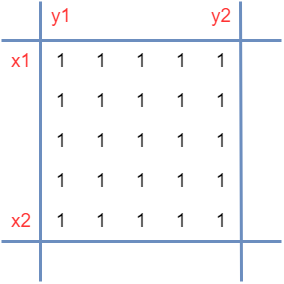
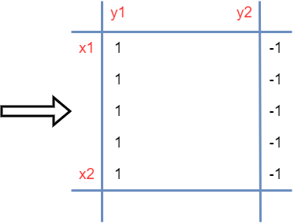
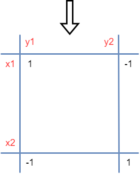

# 区域重叠问题

??? question "[问题描述](https://www.luogu.com.cn/problem/P3397)"

    # 地毯

    ## 题目描述

    在 $n\times n$ 的格子上有 $m$ 个地毯。

    给出这些地毯的信息，问每个点被多少个地毯覆盖。

    ## 输入格式

    第一行，两个正整数 $n,m$。意义如题所述。

    接下来 $m$ 行，每行两个坐标 $(x_1,y_1)$ 和 $(x_2,y_2)$，代表一块地毯，左上角是 $(x_1,y_1)$，右下角是 $(x_2,y_2)$。

    ## 输出格式

    输出 $n$ 行，每行 $n$ 个正整数。

    第 $i$ 行第 $j$ 列的正整数表示 $(i,j)$ 这个格子被多少个地毯覆盖。

    ## 样例 #1

    ### 样例输入 #1

    ```
    5 3
    2 2 3 3
    3 3 5 5
    1 2 1 4
    ```

    ### 样例输出 #1

    ```
    0 1 1 1 0
    0 1 1 0 0
    0 1 2 1 1
    0 0 1 1 1
    0 0 1 1 1
    ```

    ## 提示

    ### 样例解释

    覆盖第一个地毯后：

    |$0$|$0$|$0$|$0$|$0$|
    |:-:|:-:|:-:|:-:|:-:|
    |$0$|$1$|$1$|$0$|$0$|
    |$0$|$1$|$1$|$0$|$0$|
    |$0$|$0$|$0$|$0$|$0$|
    |$0$|$0$|$0$|$0$|$0$|

    覆盖第一、二个地毯后：

    |$0$|$0$|$0$|$0$|$0$|
    |:-:|:-:|:-:|:-:|:-:|
    |$0$|$1$|$1$|$0$|$0$|
    |$0$|$1$|$2$|$1$|$1$|
    |$0$|$0$|$1$|$1$|$1$|
    |$0$|$0$|$1$|$1$|$1$|

    覆盖所有地毯后：

    |$0$|$1$|$1$|$1$|$0$|
    |:-:|:-:|:-:|:-:|:-:|
    |$0$|$1$|$1$|$0$|$0$|
    |$0$|$1$|$2$|$1$|$1$|
    |$0$|$0$|$1$|$1$|$1$|
    |$0$|$0$|$1$|$1$|$1$|

    ---

    ### 数据范围

    对于 $20\%$ 的数据，有 $n\le 50$，$m\le 100$。

    对于 $100\%$ 的数据，有 $n,m\le 1000$。

## 前缀差分



如果按照一维的区间重叠来分析，我们得 **先固定好一个方向走**，假设我们统一从区间每一行的左侧一直走到区间的右侧，如果遇到 $1$ 就说明进入了一个区域当中，如果遇到了 $-1$ 就说明出去了一个区域，这样做就可以使得每一行都可以用一维的区间重叠来分析情况：**(差分从左边叠加过去)**



我们再进一步优化上面那图，如果 `[(x1, y1), (x2, y1)]` 都是 $1$ 的情况下，我们也可以使用差分数组快速记录差分结果，及令 `(x1, y1) = 1, (x2 + 1, y1) = -1` 这样的结果就可以使得对于每一列从上往下遍历的过程走恢复成上面那图的形状；同样道理, 如果 `[(x1, y2 + 1), (x2, y2 + 1)]` 都是 $-11$ 的情况下，我们只需要令 `(x1, y2 + 1) = -1, (x2, y2 + 1) = 1` 的差分就可以恢复成上面那副图的形状；**(差分从上面叠加下去)**



??? success "代码参考"

    ```c++
    LL n, m;
    LL a[N][N], b[N][N], c[N][N];

    void solve(void)
    {
        cin >> n >> m;
        for (LL i = 1; i <= m; i ++)
        {
            LL x1, y1, x2, y2; cin >> x1 >> y1 >> x2 >> y2;
            a[x1][y1] += 1;
            a[x2 + 1][y1] += -1;
            a[x1][y2 + 1] += -1;
            a[x2 + 1][y2 + 1] += 1;
        }
        for (LL i = 1; i <= n; i ++)
        {
            for (LL j = 1; j <= n; j ++)
            {
                b[j][i] += b[j - 1][i] + a[j][i];
            }
        }
        for (LL i = 1; i <= n; i ++)
        {
            for (LL j = 1; j <= n; j ++)
            {
                c[i][j] += c[i][j - 1] + b[i][j];
            }
        }
        for (LL i = 1; i <= n; i ++)
        {
            for (LL j = 1; j <= n; j ++)
                cout << c[i][j] << " ";
            cout << endl;
        }
    }
    ```