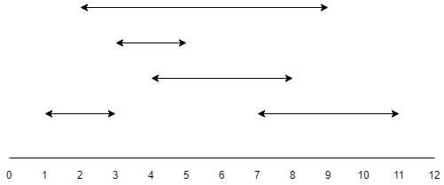

# 区间重叠问题

??? question "问题描述"

    有 `n` 个区间 `[i, j]`，有 `m` 个查询，对于每个查询都输入一个整数 `q`，请你求出有多少个区间包含这个整数。

    

## 前缀差分

先用一个数组 `a[i]` 标记以位置 `i` 作为起点的区间个数，每进入一个区间当中就要 `+1`;

接着用一个数组 `b[i]` 标记以位置 `i` 作为终点的区间个数，出去一个区间，就要 `-1`;

使用*差分数组*，我们很容易知道一个区间以 `+1` 开始，以 `-1` 结束；

我们从数组 `s[i]` 的起点 `0` 处开始往右边走，每进入一个区间就 `+1`，每出去一个区间就 `-1`，这样我们就可以获得到达位置 `i` 时，进入了多少个区间，出去了多少个区间才能到达位置 `i`，此时的 `s[i]` 就勉强可以代表位置 `i` 重叠的区间个数；

为什么说勉强呢？关键在于区间终点的边界，上面的算法默认将终点边界不纳入重叠部分，因此我们还需要特殊处理区间终点，要加上以位置 `i` 作为终点的区间个数；


??? note "代码参考"

    ```c++
    LL n, m, a[N], b[N], s[N];

    void solve(void)
    {
        cin >> n >> m;
        for (LL i = 1; i <= n; i ++)
        {
            LL t1, t2; cin >> t1 >> t2;
            a[t1] ++, b[t2] ++;
        }
        for (LL i = 0; i <= n; i ++)
        {
            // s[i] 代表到达 i 位置时，进入了多少区间，出去了多少区间
            s[i] = a[i] - b[i];
            if (i) s[i] += s[i - 1];
        }
        for (LL i = 0; i <= n; i ++)
        {
            // 特殊处理边界值
            s[i] += b[i]; 
        }
        for (LL i = 1; i <= m; i ++)
        {
            LL q; cin >> q; cout << s[q] << endl;
        }
    }
    ```