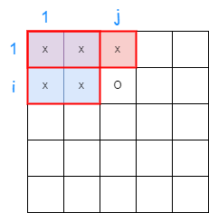
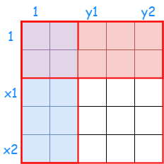

# 推导二维前缀和数组

??? question "[问题描述](https://www.luogu.com.cn/problem/P2004)"

    # 领地选择

    ## 题目描述

    作为在虚拟世界里统帅千军万马的领袖，小 Z 认为天时、地利、人和三者是缺一不可的，所以，谨慎地选择首都的位置对于小 Z 来说是非常重要的。

    首都被认为是一个占地 $C\times C$ 的正方形。小 Z 希望你寻找到一个合适的位置，使得首都所占领的位置的土地价值和最高。

    ## 输入格式

    第一行三个整数 $N,M,C$，表示地图的宽和长以及首都的边长。

    接下来 $N$ 行每行 $M$ 个整数，表示了地图上每个地块的价值。价值可能为负数。

    ## 输出格式

    一行两个整数 $X,Y$，表示首都左上角的坐标。

    ## 样例 #1

    ### 样例输入 #1

    ```
    3 4 2
    1 2 3 1
    -1 9 0 2
    2 0 1 1
    ```

    ### 样例输出 #1

    ```
    1 2
    ```

    ## 提示

    对于 $60\%$ 的数据，$N,M\le 50$。

    对于 $90\%$ 的数据，$N,M\le 300$。

    对于 $100\%$ 的数据，$1\le N,M\le 10^3$，$1\le C\le \min(N,M)$。

## 二维前缀和



如果上面那幅图中的交叉 `x` 都代表已经求出了该位置的前缀和，那么到达位置 $s[i][j]$ 新增加数据 $q[i][j]$ 时的前缀和可以由前面已知推导未知：

> $s[i][j] = q[i][j] + s[i][j - 1] + s[i - 1][j] - s[i - 1][j - 1]$

---



推导出白色区域 $[(x1, y1),\ (x2, y2)]$ 的和为：

> $sum = s[x2][y2] - s[x2][y1 - 1] - s[x1 - 1][y2] + s[x1 - 1][y1 - 1]$

---

我们只需要不断枚举所有符合条件的区间，并记录下最大值就可以求出题目的答案.

时间复杂度为 : $O((m - c + 1) \times (n - c + 1)) = O(n ^ 2) \leq 10 ^ 6$.

??? success "代码参考"

    ```c++
    LL n, m, c;
    LL res = -1e15, x, y;
    LL q[N][N], s[N][N];

    void solve(void)
    {
        cin >> n >> m >> c;
        for (LL i = 1; i <= n; i ++)
        {
            for (LL j = 1; j <= m; j ++)
            {
                cin >> q[i][j];
                s[i][j] =   q[i][j] + \
                            s[i][j - 1] + s[i - 1][j] - \
                            s[i - 1][j - 1];
            }
        }
        for (LL x1 = 1, x2; (x2 = x1 + c - 1) <= n; x1 ++)
        {
            for (LL y1 = 1, y2; (y2 = y1 + c - 1) <= m; y1 ++)
            {
                LL t =  s[x2][y2] - \
                        s[x2][y1 - 1] - s[x1 - 1][y2] + \
                        s[x1 - 1][y1 - 1];
                if (res < t) res = t, x = x1, y = y1;
            }
        }
        cout << x << " " << y << endl;
    }
    ```