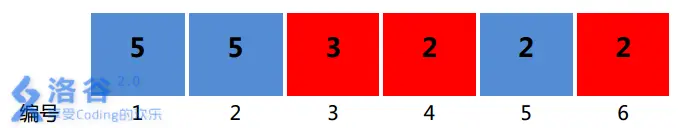

# 求和

??? question "题目描述"

    # [NOIP2015 普及组] 求和

    ## 题目背景

    NOIP2015 普及组 T3

    ## 题目描述

    一条狭长的纸带被均匀划分出了$n$个格子，格子编号从$1$到$n$。每个格子上都染了一种颜色$color_i$用$[1,m]$当中的一个整数表示），并且写了一个数字$number_i$。

     

    定义一种特殊的三元组：$(x,y,z)$，其中$x,y,z$都代表纸带上格子的编号，这里的三元组要求满足以下两个条件：

    1. $xyz$是整数,$x<y<z,y-x=z-y$

    2. $colorx=colorz$

    满足上述条件的三元组的分数规定为$(x+z) \times (number_x+number_z)$。整个纸带的分数规定为所有满足条件的三元组的分数的和。这个分数可能会很大，你只要输出整个纸带的分数除以$10,007$所得的余数即可。

    ## 输入格式

    第一行是用一个空格隔开的两个正整数$n$和$m,n$表纸带上格子的个数，$m$表纸带上颜色的种类数。

    第二行有$n$用空格隔开的正整数，第$i$数字$number$表纸带上编号为$i$格子上面写的数字。

    第三行有$n$用空格隔开的正整数，第$i$数字$color$表纸带上编号为$i$格子染的颜色。

    ## 输出格式

    一个整数，表示所求的纸带分数除以$10007$所得的余数。

    ## 样例 #1

    ### 样例输入 #1

    ```
    6 2
    5 5 3 2 2 2
    2 2 1 1 2 1
    ```

    ### 样例输出 #1

    ```
    82
    ```

    ## 样例 #2

    ### 样例输入 #2

    ```
    15 4
    5 10 8 2 2 2 9 9 7 7 5 6 4 2 4
    2 2 3 3 4 3 3 2 4 4 4 4 1 1 1
    ```

    ### 样例输出 #2

    ```
    1388
    ```

    ## 提示

    【输入输出样例 1 说明】

    纸带如题目描述中的图所示。

    所有满足条件的三元组为： $(1, 3, 5), (4, 5, 6)$。

    所以纸带的分数为$(1 + 5) \times (5 + 2) + (4 + 6) \times (2 + 2) = 42 + 40 = 82$。


    对于第 $1$ 组至第 $2$ 组数据， $1 ≤ n ≤ 100, 1 ≤ m ≤ 5$；

    对于第$ 3$ 组至第 $4$ 组数据， $1 ≤ n ≤ 3000, 1 ≤ m ≤ 100$；

    对于第 $5$ 组至第$ 6 $组数据， $1 ≤ n ≤ 100000, 1 ≤ m ≤ 100000$，且不存在出现次数超过$ 20 $的颜色；

    对 于 全 部 $10$ 组 数 据 ， $1 ≤ n ≤ 100000, 1 ≤ m ≤ 100000, 1 ≤ color_i ≤ m,1≤number_i≤100000$

## 观察规律

 

如果存在这样的三元组 `(x, y, z)` 使得 `x < y < z, y - x = z - y` 成立，首先我们可以很容易求出 `y = (x + y) / 2` 成立，又因为 `x、y、z` 都是整数，所以 `y = (x + z) / 2` 也是整数，所以 `x` 和 `z` 要么同时都是奇数，要么同时都是偶数；

题目还要求 `x` 和 `z` 的 *颜色要相同*，所以能构成这样满足题意的三元组，只需让 `x` 和 `y` *同奇或同偶且颜色相同* 即可；

我们不妨将颜色相同的且奇偶性一致的用一个链表存储起来，假设存储后的数组为：

> ${<x_1, y_1>, <x_2, y_2>, \cdots , <x_s, x_s>}$

其中 $x_i$ 代表下标，$y_i$ 代表该盒子的值，因为计算结果与颜色无关，只起到分类的作用我就没有保存到该单链表中；

如何计算该链表的分数？

先任意选取两个不同的元素下标：$i, j$，则这两个下标构成的分数为：

> $(x_i + x_j) * (y_i, y_j)$
>
> 化简后的结果：$x_iy_i + x_jy_j + x_iy_j + x_jy_i$

由于该链表中的任意两个都能构成满足条件的三元组，总和就变成了排列组合求总和的问题，但是有条件，$i < j$ 必须成立：

> $\sum_{i = 1}^{s}\sum_{j = 1}^{s} x_iy_i + x_jy_j + x_iy_j + x_jy_i$
>
> 若我们将 $i$ 固定下来思考，就可以化简成：
>
> $\sum_{i = 1}^{s}s \times x_iy_i + (x_1y_1 + \cdots + x_sy_s) + x_i \times (y_1 + \cdots + y_s) + y_i \times (x_1 + \cdots + x_s)$
>
> 对于求和操作我可以将时间复杂度降至 $O(n)$ 所以对于求和的部分用一个变量来替代：
>
> 设 $A = (x_1y_1 + \cdots + x_sy_s)$
> 设 $B = (x_1 + \cdots + x_s)$
> 设 $C = (y_1 + \cdots + y_s)$
>
> 则原公式可变为：
>
> $\sum_{i = 1}^{s}s \times x_iy_i + A + x_i \times C + y_i \times B$
>
> 若轮到 $i$ 变动，则原公式可变为：
>
> $s \times (x_1y_1 + \cdots + x_sy_s) + s \times A + 2BC$
>
> 注意这条公式求的是在该单链表中任取两个元素的总和，还需要排除掉 $i = j$ 和 $i > j$ 的部分
>
> 若 $i = j$ 则值为 ：$4A$
>
> 我们还能发现 $i > j$ 部分与 $i < j$ 部分出现的情况一致，所以 $i > j$ 与 $i < j$ 各占剩下的一半，所以：
>
> 若 $i < j$ 则推导出公式为 ：
>
> $(s \times A + s \times A + 2BC - 4A) / 2 = s \times A + BC - 2A$

通过上述的推导过程我们得到每一条单链表的求和公式为 : $s \times A + BC - 2A$;

我们要如何分类呢？

如果颜色相同且颜色为奇数，那么该下标就定义为：**M - color**;
如果颜色相同且颜色为偶数，那么该下标就定义为：**M + color**;

其中 $M = 2 * 10 ^ 5 + 10$

具体实现细节请看代码，时间复杂度为：$O(n)$.

??? success "代码参考如下"

    ```c++
    LL mod = 10007, n, m, res;
    LL cl[N], ne[N], x[N], y[N], cnt;
    LL a[N], b[N];

    void add(LL color, LL pos)
    {
        ++ cnt;
        x[cnt] = pos; y[cnt] = a[pos];
        ne[cnt] = cl[color]; 
        cl[color] = cnt;
    }

    LL calc(LL color)
    {
        LL A, B, C, S; A = B = C= S = 0;
        for (LL i = cl[color]; i; i = ne[i])
        {
            if (!i) return 0;
            S ++;
            A += x[i] * y[i]; 
            B += x[i]; C += y[i];
        }
        return ((S * A % mod) % mod + (B * C - 2 * A) % mod + mod) % mod;
    }

    void solve(void)
    {
        cin >> n >> m;
        for (LL i = 1; i <= n; i ++) cin >> a[i];
        for (LL i = 1; i <= n; i ++) cin >> b[i];

        for (LL i = 1; i <= n; i ++) 
        {
            add(b[i] * ((i & 1) ? -1 : 1) + M, i);
        }

        for (LL i = 0; i <= 2 * M; i ++)
        {
            res += calc(i); res %= mod;
        }

        cout << res << endl;
    }
    ```