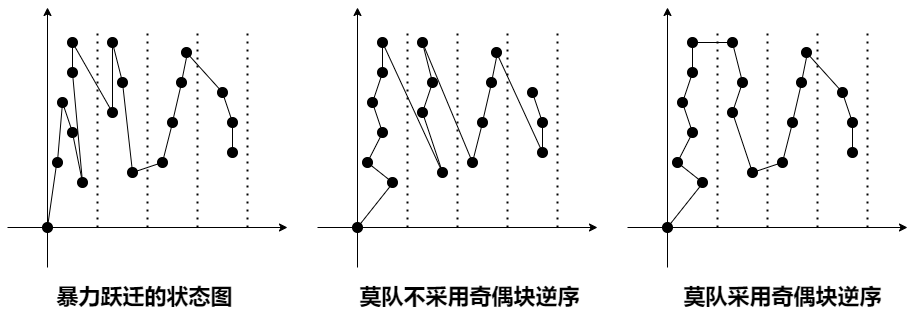
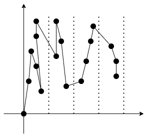
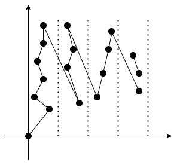
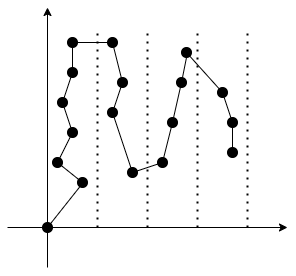

# [HH的项链](https://www.luogu.com.cn/problem/P1972)

=== "暴力与分块美学"

    时间复杂度：$O(n\sqrt{n}\log(n))$，在数据量 $10 ^ 6$ 次方下严重超时。

    !!! warning "暴力分块超时"

        ```c++
        #include <bits/stdc++.h>

        using namespace std;
        typedef long long LL;
        typedef __int128_t HH;

        const LL N = 2000000;
        const LL M = 2000;

        LL n;
        LL a[N];

        LL len, cnt;
        LL st[N], ed[N], pos[N];
        LL distinct[N];
        LL dp[M][M]; // 分块 i 到分块 j 的不同元素的个数。

        unordered_map<LL, vector<LL>> positions;

        LL query(LL left, LL right)
        {
            LL p = pos[left];
            LL q = pos[right];
            
            LL res = 0;

            unordered_set<LL> dt;

            if (p == q)
            {
                for (LL i = left; i <= right; i ++)
                {
                    dt.insert(a[i]);
                }
                res = dt.size();
            }
            else
            {
                res = dp[p + 1][q - 1];
                for (LL i = left; i <= ed[p]; i ++)
                {
                    dt.insert(a[i]);
                }
                for (LL i = st[q]; i <= right; i ++)
                {
                    dt.insert(a[i]);
                }
                for (auto x : dt)
                {
                    auto nd = positions[x];
                    auto t = lower_bound(nd.begin(), nd.end(), st[p + 1]);
                    if (t == nd.end() || *t > ed[q - 1]) res ++;
                }
            }

            return res;
        }

        void solve()
        {
            
            scanf ("%lld", &n);
            for (LL i = 1; i <= n; i ++)
            {
                scanf ("%lld", a + i);
                positions[a[i]].push_back(i);
            }
            
            unordered_set<LL> dt;

            len = sqrt(n); cnt = n / len;
            if (len * cnt < n) cnt ++;

            for (LL i = 1; i <= cnt; i ++)
            {
                st[i] = (i - 1) * len + 1;
                ed[i] = i * len;
            }

            ed[cnt] = n;

            for (LL i = 1; i <= n; i ++)
            {
                pos[i] = (i - 1) / len + 1;
            }

            for (LL i = 1; i <= cnt; i ++)
            {
                dt.clear();
                for (LL j = i; j <= cnt; j ++)
                {
                    for (LL k = st[j]; k <= ed[j]; k ++)
                    {
                        dt.insert(a[k]);
                    }
                    dp[i][j] = dt.size();
                }
            }

            LL q; scanf ("%lld", &q);

            while (q --)
            {
                LL left, right; scanf ("%lld%lld", &left, &right);

                printf ("%lld\n", query(left, right));
            }
            
        }

        int main()
        {
            
            solve();
            
            return 0;
        }
        ```
    
=== "莫队，将折线段压缩在同一块内的分块暴力莫队"

    

    暴力跃迁的状态转移路径图：

    

    莫队不采用奇偶分块逆序的路径图：

    

    莫队采用奇偶分块逆序的路径图：

    

    上面 $3$ 图我们可以直观的感受到分块莫队采用奇偶分块逆序的状态跃迁路径的短。

    能用在什么地方？如果前面那种状态的答案中存在部分可用于后面的状态，那么可以考虑莫队。

    时间复杂度：$O(n\sqrt{n})$

    ```c++
    #include <bits/stdc++.h>

    using namespace std;
    typedef long long LL;
    typedef __int128_t HH;

    void read(LL& x)
    {
        LL f = 1;
        x = 0;
        char c = getchar();
        while (!(c >= '0' && c <= '9'))
        {if (c == '-') f = -1;c = getchar();}
        while (c >= '0' && c <= '9') 
        {x = x * 10 + c - '0'; c = getchar();}
        x *= f;
    }

    const LL N = 2000000;
    const LL M = 2000;

    LL n;
    LL a[N];

    LL len, cnt;
    LL pos[N];

    struct Node
    {
        LL left, right, id;
        bool operator<(const Node& a) const 
        {
            LL p = pos[left], q = pos[a.left];
            if (p != q) return p < q;

            // 目的是为了避免相邻块跃迁时的落差不能过大，
            // 所以奇数块从大到小，紧接着偶数块从小到大。
            if (p & 1) return right > a.right; 

            return right < a.right;

        }
    };

    LL m;
    Node questions[N];

    LL ans[N];

    LL elems_cnt[N];
    LL distinct;

    void solve()
    {
        
        read(n);
        for (LL i = 1; i <= n; i ++)
        {
            read(a[i]);
        }

        len = sqrt(n); cnt = n / len;
        if (len * cnt < n) cnt ++;

        for (LL i = 1; i <= n; i ++) pos[i] = (i - 1) / len + 1;

        read(m);
        for (LL i = 1; i <= m; i ++)
        {
            LL left, right; 
            read(left); read(right);
            questions[i].left = left;
            questions[i].right = right;
            questions[i].id = i;
        }

        sort(questions + 1, questions + 1 + m);
        
        LL l = 0, r = 0;
        for (LL i = 1; i <= m; i ++)
        {
            while (l < questions[i].left) 
            {
                elems_cnt[a[l]] --;
                if (elems_cnt[a[l]] == 0) distinct --;
                l ++;
            }
            while (l > questions[i].left)
            {
                elems_cnt[a[-- l]] ++;
                if (elems_cnt[a[l]] == 1) distinct ++;
            }
            while (r > questions[i].right)
            {
                elems_cnt[a[r]] --;
                if (elems_cnt[a[r]] == 0) distinct --;
                r --;
            }
            while (r < questions[i].right)
            {
                elems_cnt[a[++ r]] ++;
                if (elems_cnt[a[r]] == 1) distinct ++;
            }
            ans[questions[i].id] = distinct;
        }

        for (LL i = 1; i <= m; i ++)
        {
            printf ("%lld\n", ans[i]);
        }
    }

    int main()
    {
        
        solve();
        
        return 0;
    }
    ```

=== "可持久化线段树"

    假设区间 $[1, i]$ 的第 $i$ 号线段树已经求出，那么对于当前第 $i + 1$ 号线段树应该如何推导出来？

    如果元素 $a[i + 1]$ 在区间 $[1, i]$ 内有出现，那么就需要把之前的位置删除，提前到位置 $i + 1$ 处，这样的好处就可以查询所有右区间是 $i + 1$ 的询问区间 $[x, i + 1]$，把旧位置提前，就更有可能被查询到。

    ```c++
    #include <stdio.h>

    #define LL int

    #define read(x) \
    {\
        x = 0;\
        char c = getchar();\
        while (!(c >= '0' && c <= '9'))\
        {c = getchar();}\
        while (c >= '0' && c <= '9')\
        {x = x * 10 + c - '0'; c = getchar();}\
    }

    const LL N = 1000001;
    LL position[N];

    struct Node
    {
        LL val, ls, rs;
    } tr[(N << 5) + N];
    LL ant;

    LL head[N];
    LL pl, pr;

    LL n, m;
    LL a[N];

    #define ls(p) tr[p].ls 
    #define rs(p) tr[p].rs

    inline void push_up(LL rt, LL pl, LL pr)
    {
        if (pl == pr) return;
        tr[rt].val = tr[ls(rt)].val + tr[rs(rt)].val;
    }

    inline void insert(LL rt1, LL& rt2, LL pl, LL pr, LL pos)
    {
        if (rt2 == 0 || rt1 == rt2) { rt2 = ++ ant; tr[rt2].ls = tr[rt1].ls; tr[rt2].rs = tr[rt1].rs; };
        if (pl == pr) { tr[rt2].val = 1; return; }
        LL mid = (pl + pr) >> 1;
        if (pos <= mid) insert(ls(rt1), ls(rt2), pl, mid, pos);
        else insert(rs(rt1), rs(rt2), mid + 1, pr, pos);
        push_up(rt2, pl, pr);
    }

    inline void erase(LL rt1, LL& rt2, LL pl, LL pr, LL pos)
    {
        if (rt2 == 0 || rt1 == rt2) { rt2 = ++ ant; tr[rt2].ls = tr[rt1].ls; tr[rt2].rs = tr[rt1].rs; };
        if (pl == pr) { tr[rt2].val = 0; return; }
        LL mid = (pl + pr) >> 1;
        if (pos <= mid) erase(ls(rt1), ls(rt2), pl, mid, pos);
        else erase(rs(rt1), rs(rt2), mid + 1, pr, pos);
        push_up(rt2, pl, pr);
    }

    inline LL query(LL rt, LL pl, LL pr, LL ll, LL rr)
    {
        if (ll <= pl && pr <= rr) return tr[rt].val;
        LL mid = (pl + pr) >> 1, res = 0;
        if (ll <= mid) res += query(ls(rt), pl, mid, ll, rr);
        if (rr > mid) res += query(rs(rt), mid + 1, pr, ll, rr);
        return res;
    }

    inline void build(LL& rt, LL pl, LL pr, LL pos)
    {
        rt = ++ ant;
        if (pl == pr)
        {
            if (pos == pl) tr[rt].val = 1;
            return;
        }
        LL mid = (pl + pr) >> 1;
        build(ls(rt), pl, mid, pos);
        build(rs(rt), mid + 1, pr, pos);
        push_up(rt, pl, pr);
    }

    LL left, right;
    char ch[32];
    LL cur, t;

    #define print(x) \
    {\
        while (x) \
        {ch[++ cur] = x % 10; x /= 10;}\
        while(cur) \
        {putchar(ch[cur --] + '0');}\
        putchar('\n');\
    }

    inline void solve()
    {
        
        read(n);
        for (LL i = 1; i <= n; i ++) read(a[i]);
        
        pl = 1; pr = n;

        build(head[1], pl, pr, 1);
        position[a[1]] = 1;

        for (LL i = 2; i <= n; i ++)
        {
            if (position[a[i]]) erase(head[i - 1], head[i], pl, pr, position[a[i]]);
            position[a[i]] = i;
            insert(head[i - 1], head[i], pl, pr, i);
        }

        read(m);

        while (m --)
        {
            read(left); read(right);
            t = query(head[right], pl, pr, left, right);
            print(t);
        }
        
    }

    int main()
    {
        
        solve();
        
        return 0;
    }
    ```