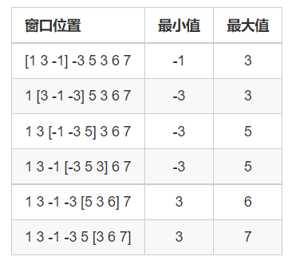

# 滑动窗口

??? question "[问题描述](https://www.acwing.com/problem/content/156/)"

    给定一个长度为 $n \leq 10 ^ 6$ 的数组.

    有一个大小为 $m$ 的滑动窗口，它从数组的左侧往右侧移动，每次只能移动一个元素单位.

    你只能看见窗口中的 $m$ 个数字.

    下面是个例子：

    

    你的任务是确定滑动窗口位于每个位置时，窗口中的最大值和最小值。

    **示例一**

    输入：

    ```
    8 3
    1 3 -1 -3 5 3 6 7
    ```

    输出：

    ```
    -1 -3 -3 -3 3 3
    3 3 5 5 6 7
    ```

## 滑动窗口

如果最新插入的数据比之前插入的数据还要小，那么输出最小值时就永远也轮不到之前小于最新值的数.

??? success "代码参考"

    ```c++
    LL n, m, a[N];
    LL mi[N], mx[N], c1, c2;

    deque< vector<LL> > q1, q2;

    void solve(void)
    {
        cin >> n >> m;
        for (LL i = 1; i <= n; i ++) cin >> a[i];

        for (LL i = 1; i < m; i ++)
        {
            while (q1.size() && q1.front()[0] >= a[i]) q1.pop_front();
            while (q2.size() && q2.front()[0] <= a[i]) q2.pop_front();

            q1.push_front({a[i], i});
            q2.push_front({a[i], i});
        }

        for (LL i = m; i <= n; i ++)
        {
            while (q1.size() && q1.front()[0] >= a[i]) q1.pop_front();
            while (q1.size() && q1.back()[1] < i - m + 1) q1.pop_back();

            while (q2.size() && q2.front()[0] <= a[i]) q2.pop_front();
            while (q2.size() && q2.back()[1] < i - m + 1) q2.pop_back();

            q1.push_front({a[i], i});
            q2.push_front({a[i], i});

            mi[c1 ++] = q1.back()[0];
            mx[c2 ++] = q2.back()[0];
        }

        for (LL i = 0; i < c1; i ++) cout << mi[i] << " ";
        cout << endl;
        for (LL i = 0; i < c2; i ++) cout << mx[i] << " ";
        cout << endl;
    }
    ```