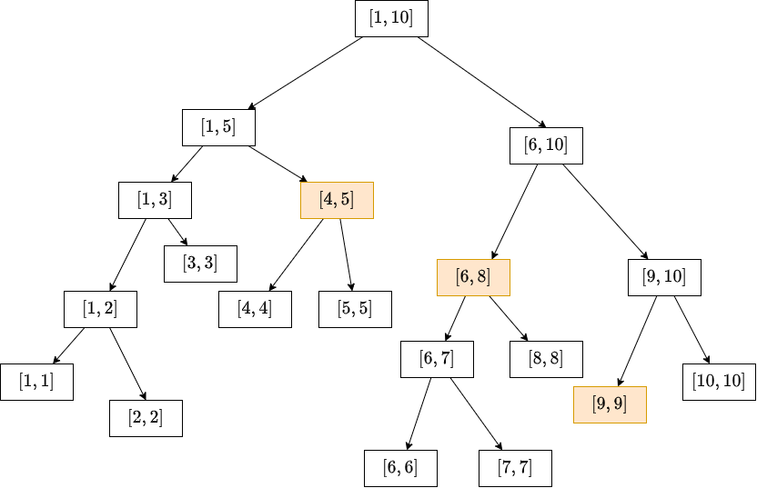

# 区间修改与查询

??? question "[问题描述](https://www.luogu.com.cn/problem/P3372)"

    已知一个数列，你需要进行下面两种操作:

    1. 将某区间上的数都加上 $k$
    2. 求出某区间的和

    数列长度为 $n$，操作次数是 $m$

    **数据大小**

    $1 \leq n, m \leq 10 ^ 5$

    $\sum \|as[i]\| \leq 10 ^ 18$

    **输入输出**

    【输入格式】

    第一行输入两个整数 $n$ 和 $m$

    第二行输入 $n$ 个整数代表数列 $as[n]$

    接下来的 $m$ 行，每行一个询问，其中：

    - `1 l r k` 将区间 $[l, r]$ 上的所有数都加上 $k$
    - `2 l r` 输出区间 $[l, r]$ 的和
 
    **样例一**

    输入：

    ```
    5 5
    1 5 4 2 3
    2 2 4
    1 2 3 2
    2 3 4
    1 1 5 1
    2 1 4
    ```

    输出：

    ```
    11
    8
    20
    ```

## 线段树 + 懒惰-标记

假设我已经预处理出线段 $[1, 10]$ 的区间和线段树，如下图：



如果要对区间 $[4, 9]$ 同时加上一个数 $k$，则图中黄色框的节点都需要做个临时标记，代表这个区间的每个数都加上了 $k$，并且这些黄色框的所有祖先节点的值都要加上改变的量.

但是这样处理，我又该如何获取黄色框 $[4, 5]$ 下面的小区间 $[4, 4]$ 的值呢？

由于标记在上面，更改内容没有传递给自己的后代，所以后代小区间 $[4, 4]$ 的值仍然滞留修改前的大小.

为了处理这个问题，我们就需要将祖宗的标记 $tag[4, 5]$ 拆开，传递到它的左右孩子 $[4, 4]$ 和 $[5, 5]$，我们不必对所有的后代都传递一遍，那样效率太低了，只需要用的时候再传递下去就行.

每更新、查询一次的时间复杂度都接近 $O(log(n))$.

---

定义函数 $push\_back$ 的含义为：将当前节点的 $tag$ 信息传达给左右孩子

```c++ title="push_back"
void push_down(LL p, LL pl, LL pr)
{
    if (tag[p] == 0) return;

    LL l = ls(p), r = ls(p);
    LL mid = (pl + pr) >> 1;

    tag[l] = tag[r] = tag[p];
    tag[p] = 0;

    ts[l] += tag[l] * (mid - l + 1);
    ts[r] += tag[r] * (r - mid);
}
```

---

定义函数 $update$ 的含义为：执行操作「区间 $[l, r]$ 的所有数同时加上 $k$」时，懒惰标记更新线段树

```c++ title="update"
void settag(LL p, LL pl, LL pr, LL k)
{
    tag[p] += k;
    tr[p] += k * (pr - pl + 1);
}

void update(LL l, LL r, LL k, LL p, LL pl, LL pr)
{
    if (l <= pl && pr <= r)
    {
        settag(p, pl, pr, k);
        return;
    }

    LL mid = (pl + pr) >> 1;

    push_down(p, pl, pr);

    if (l <= mid) update(l, r, k, ls(p), pl, mid);
    if (r > mid) update(l, r, k, rs(p), mid + 1, pr);
    
    tr[p] = tr[ls(p)] + tr[rs(p)];
}
```

---

定义函数 $query$ 的含义是查找区间 $[l, r]$ 的和.

```c++ title="query"
LL query(LL l, LL r, LL p, LL pl, LL pr)
{
    if (l <= pl && pr <= r)
    {
        return tr[p];
    }

    LL mid = (pl + pr) >> 1, res = 0;

    push_down(p, pl, pr);

    if (l <= mid) res += query(l, r, ls(p), pl, mid);
    if (r > mid) res += query(l, r, rs(p), mid + 1, pr);

    tr[p] = tr[ls(p)] + tr[rs(p)];
    return res;
}
```

---

??? success "代码参考"

    ```c++
    LL n, m;
    LL as[N], tr[N], tag[N];

    inline LL ls(LL p) { return p << 1; }
    inline LL rs(LL p) { return p << 1 | 1; }

    void push_up(LL p, LL pl, LL pr)
    {
        tr[p] = tr[ls(p)] + tr[rs(p)];
    }

    void settag(LL p, LL pl, LL pr, LL k)
    {
        tag[p] += k;
        tr[p] += (pr - pl + 1) * k;
    }

    void push_down(LL p, LL pl, LL pr)
    {
        if (tag[p] == 0) return;

        LL mid = (pl + pr) >> 1;
        settag(ls(p), pl, mid, tag[p]);
        settag(rs(p), mid + 1, pr, tag[p]);

        tag[p] = 0;
    }

    void build(LL p, LL pl, LL pr)
    {
        // tag[p] = 0; // 初始化
        if (pl == pr)
        {
            tr[p] = as[pl]; return;
        }

        LL mid = (pl + pr) >> 1;
        build(ls(p), pl, mid);
        build(rs(p), mid + 1, pr);

        push_up(p, pl, pr);
    }

    void update(LL l, LL r, LL k, LL p, LL pl, LL pr)
    {
        if (l <= pl && pr <= r)
        {
            settag(p, pl, pr, k);
            return;
        }

        LL mid = (pl + pr) >> 1;
        push_down(p, pl, pr);

        if (l <= mid) update(l, r, k, ls(p), pl, mid);
        if (r > mid) update(l, r, k, rs(p), mid + 1, pr);

        // 你有可能只更新了左区间或者右区间，
        // 此时的父节点的值要更新
        push_up(p, pl, pr);
    }

    LL query(LL l, LL r, LL p, LL pl, LL pr)
    {
        if (l <= pl && pr <= r) return tr[p];

        LL mid = (pl + pr) / 2;
        push_down(p, pl, pr);

        LL res = 0;
        if (l <= mid) res += query(l, r, ls(p), pl, mid);
        if (r > mid) res += query(l, r, rs(p), mid + 1, pr);

        // 要不要都行，查询并不会破坏逻辑大小.
        push_up(p, pl, pr);
        return res;
    }

    void solve(void)
    {
        
        n = gll(), m = gll();
        for (LL i = 1; i <= n; i ++)
            as[i] = gll();
        
        build(1, 1, n);

        while (m --)
        {
            LL mode = gll();
            if (mode == 1)
            {
                LL x, y, k;
                x = gll(), y = gll(), k = gll();

                update(x, y, k, 1, 1, n);
            }
            else if (mode == 2)
            {
                LL x, y;
                x = gll(), y = gll();

                pll(query(x, y, 1, 1, n));
            }
        }
    }
        
        
    // @auther:  huaxv
    // @data:    2023-02-27 21:06:44
    // @my-site: https://huaxv-code.github.io/huaxv-problemset/site/
    ```