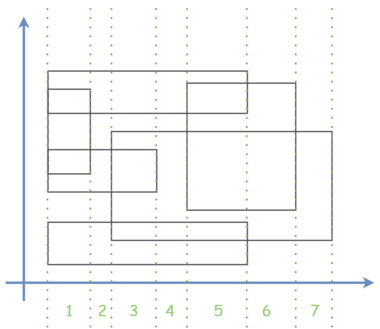

# [矩形面积](https://leetcode.cn/problems/rectangle-area-ii/description/)

=== "扫描线 + 线段树 + 离散化"

    

    从小到大排列所有平行于 y 轴的边，从小边开始，如果是某矩形的入边，就添加进线段树中，并记录线段树此时在 y 轴上积累的长度有多少，并以此求出某块的面积；

    如果是某矩形的出边，就从线段树中删掉该边。

    由于入边和出边是成对出现的，所以某条边能插入线段树中，那么到后面也一定会被删除。

    ```c++
    class Solution {
    public:
        typedef long long LL;

        static const int N = 100000;
        static const LL mod = 1000000007;

        struct Node {
            LL x, a, b;     
            LL inout;
            Node(LL tx = 0, LL ta = 0, LL tb = 0, LL tinout = 0) {
                x = tx; a = ta; b = tb;
                inout = tinout;
            }
            bool operator<(const Node& nd) const {
                return x < nd.x;
            }
        };

        Node es[N];
        LL cnt;

        LL as[N];
        LL cur;

        LL find(LL x) {
            LL l = 1, r = cur, mid;
            while (l < r) {
                mid = (l + r) >> 1;
                if (as[mid] < x) l = mid + 1;
                else r = mid;
            }
            return r;
        }

        LL length[N << 2];
        LL sum[N << 2];

        inline LL lc(LL p) { return p << 1; }
        inline LL rc(LL p) { return p << 1 | 1; }

        void push_up(LL p, LL l, LL r) {
            if (sum[p]) length[p] = as[r + 1] - as[l];
            else length[p] = length[lc(p)] + length[rc(p)];
            length[p] %= mod;
        }

        // 为什么不用定义 push_down 函数将区间个数传递给子区间？
        // 首先矩形的左右两边是成对出现的，所以在之前如果存在对区间 [a, b] 个数 + 1，那么到后面也一定存在对区间 [a, b] 个数 - 1，这是成对出现的；
        // 再者，如果区间 [a, b] 的个数为 0 时，虽然当前的 length[a, b] 确实等于 0，但是不排除存在子区间 [c, d] 的个数不为 0，所以 length[p] = 0, length[p] = length[lc(p)] + length[rc(p)]；


        // 需要将连续区间 [1, cur] 分成编号为：1, 2, 3, ···, cur - 1 的块，
        // 如果需要对区间 [l, r] 的个数 + 1，就相当于是对块 l, l+1, l+2, ···, r - 1 的个数同时 + 1 
        // 那么 l 到 r 块的长度等于多少？   --- as[r + 1] - as[l]

        void add(LL p, LL l, LL r, LL ll, LL rr, LL inout) {
            if (ll > rr) return;
            if (ll <= l && r <= rr) {
                sum[p] += inout;
                push_up(p, l, r);
                return;
            }

            LL mid = (l + r) >> 1;

            if (ll <= mid) add(lc(p), l, mid, ll, rr, inout);
            if (rr > mid) add(rc(p), mid + 1, r, ll, rr, inout);

            push_up(p, l, r);
        }

        int rectangleArea(vector<vector<int>>& rectangles) {
            for (auto nd : rectangles) {
                es[++ cnt] = Node(
                    nd[0], nd[1], nd[3], 1
                );
                es[++ cnt] = Node(
                    nd[2], nd[1], nd[3], -1
                );
                as[++ cur] = nd[1];
                as[++ cur] = nd[3];
            }

            sort(as + 1, as + 1 + cur);
            sort(es + 1, es + 1 + cnt);

            cur = unique(as + 1, as + 1 + cur) - (as + 1);

            add(1, 1, cur - 1, find(es[1].a), find(es[1].b) - 1, es[1].inout);

            LL res = 0;


            // 这样写有什么妙处？
            // 如果有很多变的 x 轴坐标相同，但是却是垂直排布时，并不会重复计算面积，而是只做到了插入边的效果，因为 es[i].x - es[i - 1].x 这一步会等于 0.

            for (LL i = 2; i <= cnt; i ++) {
                res += length[1] * (es[i].x - es[i - 1].x);
                res %= mod;
                add(1, 1, cur - 1, find(es[i].a), find(es[i].b) - 1, es[i].inout);
            }

            return res % mod;
        }
    };
    ```