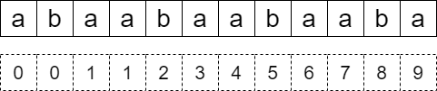

# [周期](https://www.acwing.com/problem/content/143/)

=== "KMP"

    **推导 KMP**

    数值 $kmp[i]$ 代表子串 $1 \sim i$ 中最大相同前后缀长度。

    例如：

    

    代码上怎么实现，自己推导吧，我是记不住模板的！

    ```java
    kmp[1] = 0;

    for (int i = 1, j = 2; j <= n;) {
        if (s.charAt(i) == s.charAt(j)) {
            kmp[j] = i; i ++; j ++;
        } else {
            if (i == 1) { // 都到 1 了还不相等，就说明没有最大相同前后缀
                kmp[j] = 0; j ++; continue;
            }
            i = kmp[i - 1] + 1;
        }
    }
    ```

    ---

    如果该子串是形如：$AAAAAAAAA$ 的循环子串，那么最后一个 $kmp[len]$ 的长度一定等于 $len - kmp[len]$，逻辑上就是匹配少了个循环节。

    并且 $len - kmp[len] < len$ 且 $(len - kmp[len]) | len$.

    ---

    另提一嘴，`BufferedReader` 读取到文件末尾时，`readLine` 会返回 `null`，`read` 会返回 $-1$，不要用 $read$ 来判断文件末尾。
 
    ---

    ```java
    import java.util.* ;
    import java.io.* ;
    import java.math.* ;

    public class Main {

        int N = 2000000;
        
        int n;
        String s;
        int[] kmp = new int[N];

        static public int ct;
        
        public void solve() throws Exception {
            
            String[] ts = cin.readLine().split(space);

            n = gii(ts[0]);
            s = "?" + cin.readLine().split(space)[0];

            kmp[1] = 0;

            for (int i = 1, j = 2; j <= n;) {
                if (s.charAt(i) == s.charAt(j)) {
                    kmp[j] = i; i ++; j ++;
                } else {
                    if (i == 1) {
                        kmp[j] = 0; j ++; continue;
                    }
                    i = kmp[i - 1] + 1;
                }
            }

            cout.println("Test case #" + ct);

            for (int i = 1; i <= n; i ++) {
                int k = i - kmp[i];
                if (i % k == 0 && i > k) {
                    cout.println(i + " " + i / k);
                }
            }

            cout.println();
            
        }

        public static void main(String[] args) throws Exception {
            
            Main cmd = new Main();
            try {
                for (int i = 1;; i ++) {
                    ct ++;
                    cmd.solve();
                }
            } catch (Exception e) {

            }
            cout.flush();
            
        }

        public static String space = "\\s+"; 

        public static BufferedReader cin = new BufferedReader(new InputStreamReader(System.in));
        public static PrintWriter cout = new PrintWriter(new OutputStreamWriter(System.out));
        public static StreamTokenizer next = new StreamTokenizer(cin);
        public static Scanner sin = new Scanner(System.in);
        
        public static int gii() throws Exception {
            next.nextToken();
            return (int)next.nval;
        }

        public static long gll() throws Exception {
            next.nextToken();
            return (long)next.nval;
        }

        public static double gff() throws Exception {
            next.nextToken();
            return (double)next.nval;
        }

        public static int gii(String s) {
            return Integer.parseInt(s);
        }

        public static long gll(String s) {
            return Long.parseLong(s);
        }

        public static double gff(String s) {
            return Double.parseDouble(s);
        }
    }
    ```