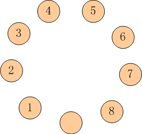

# 跳蚱蜢

??? question "[问题描述](https://www.lanqiao.cn/problems/642/learning/)"

	有 $9$ 个盘子，排成一个圆圈，初始时蚱蜢排列的位置如下图.

	??? info "初始位置"

		

	规定：

	- 每只蚱蜢都能跳到隔壁的空盘子中；
	- 每只蚱蜢都能越过一只蚱蜢跳到空盘子中；

	问保持空盘子的位置不变的前提下，使得蚂蚱的排列顺序变成逆时针时最少需要跳跃多少次？

## 暴力 bfs

??? warning "严重超时"

	```c++
	vector<LL> iit = {0, 1, 2, 3, 4, 5, 6, 7, 8, 0};
	LL n = 9;
	queue<vector<LL>> qu;

	bool ok(const vector<LL>& iit)
	{
		for (LL i = 1; i <= 8; i ++)
			if (iit[i] + i != 9) return false;
		return true;
	}

	void solve(void)
	{
		qu.push(iit);
		while (qu.size())
		{
			auto tp = qu.front(); qu.pop();
			if (ok(tp)) { pll(tp.back()); return; }
			int k = 0;
			while (tp[k] != 0 && k < n) k ++;
			if (k >= n) return;
			vector<LL> node;

			node = tp; node.back() += 1; 
			swap(node[k], node[(k + 1) % 9]);
			qu.push(node);

			node = tp; node.back() += 1; 
			swap(node[k], node[(k + 2) % 9]);
			qu.push(node);

			node = tp; node.back() += 1; 
			swap(node[k], node[(k + 8) % 9]);
			qu.push(node);

			node = tp; node.back() += 1; 
			swap(node[k], node[(k + 7) % 9]);
			qu.push(node);
		}
	}
	```

## 剪枝 bfs

??? success "代码参考"

	```c++
	struct Node
	{
		string s;
		LL ts;
	};

	string s = "012345678";
	unordered_set<string> st;
	queue<Node> qu;

	bool ok(string s)
	{
		return s == "087654321";
	}

	void solve(void)
	{
		qu.push({s, 0});
		while (qu.size())
		{
			auto nd = qu.front(); qu.pop();
			if (st.find(nd.s) != st.end()) continue;
			st.insert(nd.s);
			if (ok(nd.s)) { pll(nd.ts); return; }
			int k = 0;
			while (nd.s[k] != '0') k ++;
			string t;
			
			t = nd.s;
			swap(t[k], t[(k + 1) % 9]);
			qu.push({t, nd.ts + 1});

			t = nd.s;
			swap(t[k], t[(k + 8) % 9]);
			qu.push({t, nd.ts + 1});

			t = nd.s;
			swap(t[k], t[(k + 2) % 9]);
			qu.push({t, nd.ts + 1});

			t = nd.s;
			swap(t[k], t[(k + 7) % 9]);
			qu.push({t, nd.ts + 1});
		}
	}
	```