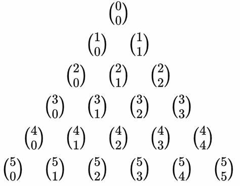

# 分扑克牌

??? question "[问题描述](https://www.luogu.com.cn/problem/P1358)"

    从一副含有 $m$ 张牌的扑克牌中（每张牌都不一样），分给 $n$ 个人，第 $i$ 个人需要分得 $a[i]$ 张牌，数据保证 $a[1···n]$ 的总和小于等于 $m$.

    问有多少种不同的分法？

    该数可能十分庞大，请对结果取模 $10007$.

    **数据范围**

    $1 \leq m \leq 10 ^ 4$

    $1 \leq n, a[i] \leq 100$

    **输入输出**

    【输入格式】

    第一行输入两个整数，分别代表 $m$ 和 $n$

    第二行输入 $n$ 个整数，分别代表 $a[i]$

    【输出格式】

    输出只有一个整数，代表答案.

    **样例一**

    输入：

    ```
    20 19
    1 1 1 1 1 1 1 1 1 1 1 1 1 1 1 1 1 1 1
    ```

    输出：

    ```
    8707
    ```

    **样例二**

    输入：

    ```
    5 2
    3 1
    ```

    输出：

    ```
    20
    ```

## 杨辉三角推导组合数

使用杨辉三角推导组合数可以避免取模除法的出现：



递推公式：

> $\binom{m}{n} = \binom{m - 1}{n} + \binom{m - 1}{n - 1}$

题目的数据范围最大的组合数为 $\binom{m}{\max(a[1 \cdots n])}$ 所以对于行只用枚举到 $m$ 对于列只用枚举到 $\max(a[1 \cdots n])$.

??? success "代码参考"

    ```c++
    LL mod = 10007;
    LL m, n, a[N], res = 1, mx;
    LL cxy[10100][110] = {1};

    void solve(void)
    {
        m = gll();
        n = gll();
        for (LL i = 1; i <= n; i ++) 
            a[i] = gll(), mx = max(mx, a[i]);

        for (LL i = 1; i <= m; i ++)
        {
            for (LL j = 0; j <= mx && j <= i; j ++)
            {
                if (j == 0) cxy[i][j] = 1;
                else if (j == i) cxy[i][j] = 1;
                else
                {
                    cxy[i][j] = cxy[i - 1][j] + cxy[i - 1][j - 1];
                    cxy[i][j] %= mod;
                }
            }
        }

        for (LL i = 1; i <= n; i ++)
        {
            res *= cxy[m][a[i]];
            res %= mod;
            m -= a[i];
        }   

        pll(res);
    }
    ```