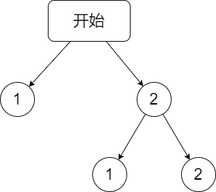
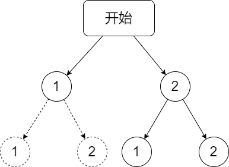
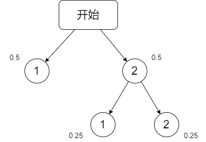

# [fair competing](https://ac.nowcoder.com/acm/contest/17797/L)

=== "暴力随机化模拟"

    ```java
    import java.util.* ;
    import java.io.* ;
    import java.math.* ;

    public class Main {

        Random nr = new Random();
        int[] st = new int[4];
        long ct, sm;

        boolean ok() {
            for (int aa : st) {
                if (aa == 2) return true;
            }
            return false;
        }

        void dfs(int p, int id) {
            if (ok()) {
                ct ++; sm += p;
                return;
            }
            if (id == 0) {
                int a = nr.nextInt(3) + 1;
                dfs(p, a);
                return;
            }
            int a = nr.nextInt(2) + 1;
            int on = 0;
            for (int i = 1; i <= 3; i ++) {
                if (id == i) continue;
                on ++;
                if (a == on) {
                    st[i] ++; 
                    dfs(p + 1, i);
                    st[i] --;
                    return;
                }
            }
        }

        public void solve() throws Exception {
            for (int i = 0; i < 100000; i ++) {
                dfs(0, 0);
            }
            cout.printf("%.1f", 1.0 * sm / ct);
        }

        public static void main(String[] args) throws Exception {
            
            Main cmd = new Main();
            cmd.solve();
            cout.flush();
            
        }

        public static BufferedReader cin = new BufferedReader(new InputStreamReader(System.in));
        public static PrintWriter cout = new PrintWriter(new OutputStreamWriter(System.out));
        public static StreamTokenizer next = new StreamTokenizer(cin);

        int gii() throws Exception {
            next.nextToken();
            return (int)next.nval;
        }

        long gll() throws Exception {
            next.nextToken();
            return (long)next.nval;
        }

        double gff() throws Exception {
            next.nextToken();
            return (double)next.nval;
        }
    }
    ```

=== "很容易思维误区的 “统计次数”"

    今天做题时，很自然而然的就想用 dfs 统计游戏结束时出现 3 轮次的次数和出现 4 轮次的次数，然后用这些轮次乘上各自出现的次数 除以 总次数得到最终概率，这是错误的。

    参考下面的小题：

    **投硬币游戏：**

    一枚硬币只有 $1$ 和 $2$ 两面，并且投掷的概率相同都是 五五开。

    游戏规则如下：
    
    - 出现 $1$ 时游戏结束；
    - 出现两次 $2$ 时游戏结束。

    问最后一次出现 $1$ 的概率是多少？

    ---

    {width="40%"}

    是 $2/3$ 呢？

    ---

    {width="40%"}

    还是 $3/4$ 呢？

    ---
    
    答案肯定是 $3/4$ ：

    {width="40%"}

    ---

    以此小题，引以为鉴。

    ```java
    import java.util.* ;
    import java.io.* ;
    import java.math.* ;

    public class Main {

        int[] st = new int[4];

        double sm, ct;

        boolean ok() {
            for (int aa : st) {
                if (aa == 2) return true;
            }
            return false;
        }

        void dfs(long p, int id, int on) {
            if (ok()) {
                int a = id + 1;
                int b = id + 2;
                if (a == 4) a = 1;
                if (b == 4) b = 1;

                if (p == 3) {
                    dfs(p + 1, a, 1);
                    dfs(p + 1, b, 1);
                } else {
                    sm += p; ct ++;
                    if (on == 1) sm --;
                }

                return;
            }

            for (int i = 1; i <= 3; i ++) {
                if (i == id) continue;
                st[i] ++;
                dfs(p + 1, i, 0);
                st[i] --;
            }
        }

        public void solve() throws Exception {
            for (int i = 1; i <= 3; i ++) {
                dfs(0, i, 0);
            }

            // cout.println(sm + " " + ct);
            cout.printf("%.1f\n", 1.0 * sm / ct);
        }

        public static void main(String[] args) throws Exception {
            
            Main cmd = new Main();
            cmd.solve();
            cout.flush();
            
        }

        public static BufferedReader cin = new BufferedReader(new InputStreamReader(System.in));
        public static PrintWriter cout = new PrintWriter(new OutputStreamWriter(System.out));
        public static StreamTokenizer next = new StreamTokenizer(cin);

        int gii() throws Exception {
            next.nextToken();
            return (int)next.nval;
        }

        long gll() throws Exception {
            next.nextToken();
            return (long)next.nval;
        }

        double gff() throws Exception {
            next.nextToken();
            return (double)next.nval;
        }
    }
    ```