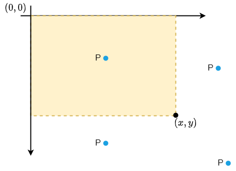

# 重叠面积比值

??? question "[题目大意](https://ac.nowcoder.com/acm/contest/46800/D)"

    给定一个矩形 $S$，其左上角的坐标为 $(0, 0)$，右下角的坐标为 $(x, y)$，接着给定一个点 $(p, q)$.

    请你找到一个以点 $(p, q)$ 作为顶点且边都平行于坐标轴的矩形 $K$，使得 $S$ 与 $K$ 的交集面积与并集面积的比值最大，输出该最大比值；

    **数据范围**

    $x、y、p、q$ 都是正整数；

    答案保证在 `double` 范围内，四舍五入到小数点后 $9$ 位；

    **输入描述**

    第一行输入一个整数 $T$ 代表测试样例的数量；

    对于每一个测试样例都只输入一行，并且该行上有 $4$ 个正整数分别代表 $x、y、p、q$；

    **输出描述**

    输出 $T$ 行，分别代表对应测试样例的正确结果，四舍五入到小数点后 $9$ 位；

    **输入样例**

    ```
    3
    3 4 1 2
    3 4 5 5
    3 4 1 5
    ```

    **输出样例**

    ```
    0.333333333
    0.480000000
    0.571428571
    ```

## 分类讨论点可能的出现情况



黄色部分矩形就是矩形 $S$.

