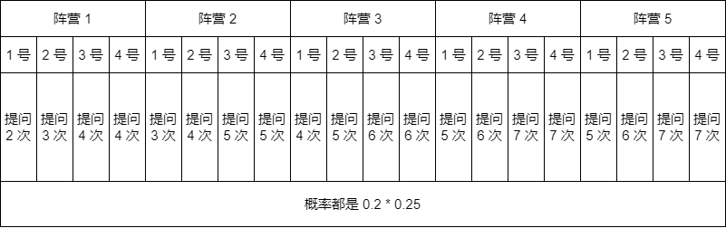

# 猜中的期望次数

??? question "[题目描述](https://ac.nowcoder.com/acm/contest/46800/L)"

    在某个游戏中有 $20$ 个人物特性鲜明角色，分别属于不同的 $5$ 大阵营，对于每个阵营都只有 $4$ 位角色；

    已知小红很喜欢该游戏的某位角色，现在需要你来猜测该游戏角色是谁；

    你只可以像这样提问：

    - 你喜欢的角色在第 1 阵营吗？回答：是。
    - 你喜欢的角色是第 1 阵营的第 1 位角色吗？回答：不是。
    - 你喜欢的角色是第 1 阵营的第 2 位角色吗？回答：不是。
    - 你喜欢的角色是第 1 阵营的第 3 位角色吗？回答：是。

    像这样提问，你只用了 $4$ 次就能 $100\%$ 确定小红喜欢的游戏角色。

    你想知道，在动用最优策略的情况下，使得提问的次数最少并且还能 $100\%$ 确定小红喜欢的游戏角色，需要的平均提问的次数期望值是多少次？

    答案可能是小数。

## 找分布规律

先猜测阵营，属于哪里：

- 属于第 1 个阵营吗？如果回答是，就在第 1 个阵营里面找，否则接着问属于哪个阵营；
- 属于第 2 个阵营吗？如果回答是，就在第 2 个阵营里面找，否则接着问属于哪个阵营；
- 属于第 3 个阵营吗？如果回答是，就在第 3 个阵营里面找，否则接着问属于哪个阵营；
- 属于第 4 个阵营吗？如果回答是，就在第 4 个阵营里面找，否则那就肯定属于第 5 个阵营；

已知它属于第 $x$ 个阵营之后，就继续猜测他是第几位角色：

- 是第 $x$ 个阵营的第 1 位角色吗？如果是，就求出此时的概率与次数；否则继续往下猜；
- 是第 $x$ 个阵营的第 2 位角色吗？如果是，就求出此时的概率与次数；否则继续往下猜；
- 是第 $x$ 个阵营的第 3 位角色吗？如果是，就求出此时的概率与次数；否则就一定是最后一位角色了；

所以，概率分布可以用下面这副图来描述：



动手可以算出期望次数为：$5.05$ 次；

??? success "参考代码"

    ```c++
    void solve()
    {
        double res = 0;
        for (LL i = 1; i <= 4; i ++)
        {
            res += ((i - 1) * 4 + 2 + 3 + 4 + 4) * 0.20 * 0.25;
        }
        res += (3 * 4 + 2 + 3 + 4 + 4) * 0.20 * 0.25;
        cout << res << endl;
        // cout << 5.05 << endl;
    }
    ```