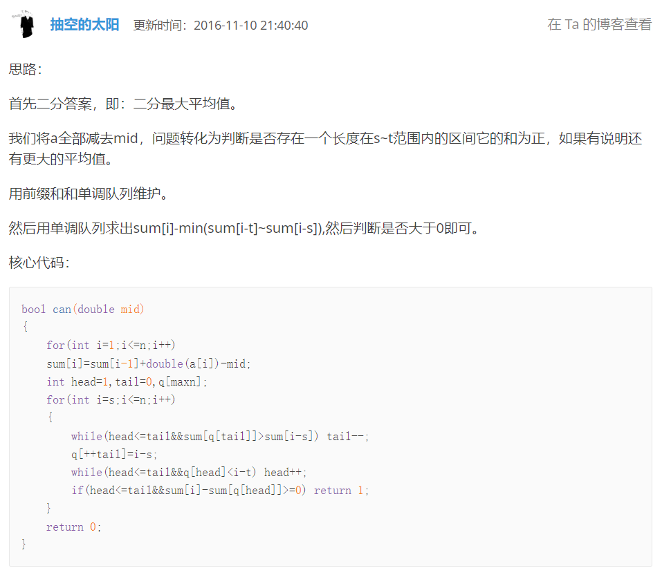

# 寻找段落

??? question "[问题描述](https://www.luogu.com.cn/problem/P1419)"

    # 寻找段落

    ## 题目描述

    给定一个长度为 $n$ 的序列 $a$，定义 $a_i$ 为第 $i$ 个元素的价值。现在需要找出序列中最有价值的“段落”。段落的定义是长度在 $[S, T]$ 之间的连续序列。最有价值段落是指平均值最大的段落。

    **段落的平均值** 等于 **段落总价值** 除以 **段落长度**。

    ## 输入格式

    第一行一个整数 $n$，表示序列长度。

    第二行两个整数 $S$ 和 $T$，表示段落长度的范围，在 $[S, T]$ 之间。

    第三行到第 $n+2$ 行，每行一个整数表示每个元素的价值指数。

    ## 输出格式

    一个实数，保留 $3$ 位小数，表示最优段落的平均值。

    ## 样例 #1

    ### 样例输入 #1

    ```
    3
    2 2
    3
    -1
    2
    ```

    ### 样例输出 #1

    ```
    1.000
    ```

    ## 提示

    【数据范围】

    对于 $30\%$ 的数据有 $n \le 1000$。

    对于 $100\%$ 的数据有 $1 \le n \le 100000$，$1 \le S \le T \le n$，$-{10}^4 \le a_i \le {10}^4$。

    【题目来源】

    tinylic 改编

## 二分

二分枚举最优段落的平均值：

如果该平均值符合条件，就往大的方向枚举；

如果该平均值不符合条件，就说明该平均值太大了，要往小的方向枚举；

暴力判断超时：

时间复杂度估测：$O(n ^ 2 log(n))$

??? warning "超时代码"

    ```c++
    LL n, s, t;
    double a[N], sb[N];
    double eps = 1e-14, es = 1e-4;

    bool ok(double x)
    {
        double sum = 0;
        for (LL i = 1; i + s - 1 <= n; i ++)
        {
            for (LL j = s; j <= t; j ++)
            {
                if (i + j - 1 > n) break;
                if (sb[i + j - 1] - sb[i - 1] >= x * j) return true;
            }
        }
        return false;
    }

    void solve(void)
    {
        cin >> n >> s >> t;
        for (LL i = 1; i <= n; i ++) 
        {
            cin >> a[i]; sb[i] = a[i] + sb[i - 1];
        }

        double l, r, mid;

        l = -1e9, r = 1e9;
        while (r - l >= es)
        {
            mid = (l + r) / 2;
            if (ok(mid)) l = mid;
            else r = mid;
        }

        printf ("%.3f\n", l);
    }
    ```

## 二分 + 单调队列

二分枚举平均值：

先假设最大的平均值就是二分枚举的值，设为 $x$，然后将数组上的每一个元素都减去 $x$.

如果存在连续区间的长度 $s \leq len \leq t$，并且该区间的和大于 $0$，则平均值 $x$ 满足条件，$x$ 还可以向上枚举.

如果不存在，就要往下枚举.

用前缀和数组求出连续区间的和.

设满足条件的区间的终点为 $s \leq p \leq n$，起点为 $p - t + 1 \leq q \leq p - s + 1$，若要让该区间的和 $sum[p] - sum[q]$ 最大化，就得让 $sum[q]$ 最小，所以需要保留 $p - t + 1 \leq q \leq p - s + 1$ 内的最小值，使用单调队列维护 $sum[q]$ 的最小值；

如果新插入的数据 $sum[p - s + 1]$ 大于队列尾部，就要将尾部的数据删掉然后才能放入，维护单调递增性;

如果头部数据的坐标小于 $p - t + 1$ 就表示超出范围，需要删掉头部数据.

时间复杂度估测：$O(nlog(n))$

??? info "大佬描述"

    

??? success "代码参考"

    ```c++
    LL n, s, t;
    double a[N], sb[N];
    double eps = 1e-14, es = 1e-4;

    LL ll, rr;
    double v[N], p[N];


    bool ok(double x)
    {
        sb[0] = 0;
        for (LL i = 1; i <= n; i ++) sb[i] = sb[i - 1] + a[i] - x;

        ll = rr = 0;
        for (LL i = s, j = 0; i <= n; i ++, j ++)
        {
            while (rr > ll && v[rr - 1] >= sb[j]) rr --;
            v[rr] = sb[j], p[rr] = j, rr ++;
            while (rr > ll && p[ll] < i - t + 1) ll ++;

            if (sb[i] - v[ll] >= 0) return true;
        }

        return false;
    }

    void solve(void)
    {
        scanf ("%lld%lld%lld", &n, &s, &t);
        for (LL i = 1; i <= n; i ++) 
        {// long long    -> %lld
        // double       -> %lf
        // float        -> %f
        // long double  -> %Lf
            scanf ("%lf", a + i);
        }

        double l, r, mid;

        l = -1e4, r = 1e4;
        while (r - l >= es)
        {
            mid = (l + r) / 2;
            if (ok(mid)) l = mid;
            else r = mid;
        }

        printf ("%.3f\n", l);
    }
    ```