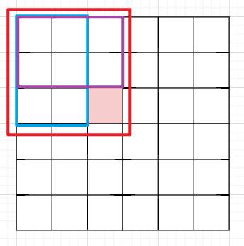

# [Java 组代码模板]()

## 代码片段

```java
import java.util.*;
import java.io.*;
import java.math.*;

public class Main 
{
    
    final int N = 500000; // 1e6 已经快超时了


    

    
    public void solve() throws Exception 
    {
        
        
        
    }

    public static void main(String[] args) throws Exception 
    {
        
        Main cmd = new Main();
        cmd.solve();
        cout.flush();
        
    }

    public static String space = "\\s+"; 

    public static BufferedReader cin = new BufferedReader(new InputStreamReader(System.in));
    public static PrintWriter cout = new PrintWriter(new OutputStreamWriter(System.out));

    public static String[] gss() throws Exception
    {
        return cin.readLine().split(space);
    }

    public static int gii(String s) 
    {
        return Integer.parseInt(s);
    }

    public static long gll(String s) 
    {
        return Long.parseLong(s);
    }

    public static double gff(String s) 
    {
        return Double.parseDouble(s);
    }
}
```

## 快速排序

时间复杂度：$O(nlog(n))$

```java
int n;
int[] a = new int[N];

void qsort(int l, int r)
{
    if (l >= r) return;
    int x = a[(l + r) >> 1];
    int i = l - 1, j = r + 1;
    while (i < j)
    {
        while (a[++ i] < x);
        while (a[-- j] > x);
        if (i < j)
        {
            int t = a[i];
            a[i] = a[j];
            a[j] = t;
        }
    }
    qsort(l, j);
    qsort(j + 1, r);
}

public void solve() throws Exception 
{
    
    String[] ts = gss();
    n = gii(ts[0]);
    ts = gss();
    for (int i = 1; i <= n; i ++)
    {
        a[i] = gii(ts[i - 1]);
    }

    qsort(1, n);
    for (int i = 1; i <= n; i ++)
        cout.print(a[i] + " ");
    cout.println();
}
```

## 快速排序找第 k 个数

时间复杂度：$O(n)$

```java
int n, k;
int[] a = new int[N];

int qsort(int l, int r, int k)
{
    if (l == r) return a[l];
    int x = a[(l + r) >> 1];
    int i = l - 1, j = r + 1;
    while (i < j)
    {
        while (a[++ i] < x);
        while (a[-- j] > x);
        if (i < j)
        {
            int t = a[i];
            a[i] = a[j];
            a[j] = t;
        }
    }
    if (k <= j) return qsort(l, j, k);
    else return qsort(j + 1, r, k);
}


void solve() throws Exception
{
    
    String[] ts = gss();
    n = gii(ts[0]);
    k = gii(ts[1]);
    ts = gss();
    
    for (int i = 1; i <= n; i ++)
    {
        a[i] = gii(ts[i - 1]);
    }
    
    cout.println(qsort(1, n, k));
    
}
```

## 归并排序

```java
int n;
int[] a = new int[N];
int[] b = new int[N];

void meld(int l, int r)
{
	if (l >= r) return;
	int mid = (l + r) >> 1;
	meld(l, mid);
	meld(mid + 1, r);
	int i = l, j = mid + 1;
	int k = 0;
	while (i <= mid && j <= r)
	{
		if (a[i] <= a[j]) b[k ++] = a[i ++];
		else b[k ++] = a[j ++];
	}
	while (i <= mid) b[k ++] = a[i ++];
	while (j <= r) b[k ++] = a[j ++];
	i = l;
	j = 0;
	while (i <= r) a[i ++] = b[j ++];
}


void solve() throws Exception
{
	
	String[] ts = gss();
	n = gii(ts[0]);
	ts = gss();
	for (int i = 1; i <= n; i ++)
	{
		a[i] = gii(ts[i - 1]);
	}
	meld(1, n);
	for (int i = 1; i <= n; i ++)
	{
		cout.print(a[i] + " ");
	}
	cout.println();
	
}
```

## 归并排序逆序对

```java
int n;
int[] a = new int[N];
int[] b = new int[N];

long meld(int l, int r)
{
	if (l >= r) return 0;
	int mid = (l + r) >> 1;
	long res = 0;
	res += meld(l, mid);
	res += meld(mid + 1, r);
	int i = l, j = mid + 1, k = 0;
	while (i <= mid && j <= r)
	{
		if (a[i] <= a[j])
		{
			b[k ++] = a[i ++];
		}
		else
		{
			b[k ++] = a[j ++];
			res += mid - i + 1;
		}
	}
	while (i <= mid) b[k ++] = a[i ++];
	while (j <= r) b[k ++] = a[j ++];
	i = l;
	j = 0;
	while (i <= r) a[i ++] = b[j ++];
	return res;
}

void solve() throws Exception
{
	
	String[] ts = gss();
	n = gii(ts[0]);
	ts = gss();
	for (int i = 1; i <= n; i ++)
	{
		a[i] = gii(ts[i - 1]);
	}
	cout.println(meld(1, n));
}
```

## 二分查找

```java
int n, q;
int[] a = new int[N];

int lf(int x)
{
	int l = 1, r = n, mid;
	while (l < r)
	{
		mid = (l + r) >> 1;
		if (a[mid] < x) l = mid + 1;
		else r = mid;
	}
	if (a[r] == x) return r - 1;
	else return -1;
}

int rf(int x)
{
	int l = 1, r = n, mid;
	while (l < r)
	{
		mid = (l + r + 1) >> 1;
		if (a[mid] <= x) l = mid;
		else r = mid - 1;
	}
	if (a[l] == x) return l - 1;
	else return -1;
}

void solve() throws Exception
{
	
	String[] ts = gss();
	n = gii(ts[0]);
	q = gii(ts[1]);
	ts = gss();
	for (int i = 1; i <= n; i ++)
	{
		a[i] = gii(ts[i - 1]);
	}
	
	Arrays.sort(a, 1, n + 1);
	
	while (q -- > 0)
	{
		ts = gss();
		int x = gii(ts[0]);
		cout.println(lf(x) + " " + rf(x));
	}
	
}
```

## 二分查找-数的三次方根

```java
double n;

double f(double n)
{
	double l = Math.min(n, -1);
	double r = Math.max(1, n);
	double mid;
	double ep = 1e-7;
	while (Math.abs(l - r) > ep)
	{
		mid = (l + r) / 2;
		if (Math.pow(mid, 3) < n) l = mid;
		else r = mid;
	}
	return l;
}

void solve() throws Exception
{
	
	String[] ts = gss();
	n = gff(ts[0]);
	
	cout.printf("%.6f\n", f(n));
}
```

## 高精度加法

```java
int[] a = new int[N];
int[] b = new int[N];
int[] c = new int[N];
int n, m;

int cg(int[] a, String s)
{
	if (s.equals("0")) 
	{
		a[0] = 0; return 1;
	}
	int n = s.length();
	for (int i = n - 1, j = 0; i >= 0; i --, j ++)
	{
		a[j] = (int)(s.charAt(i) - '0');
	}
	return n;
}


void solve() throws Exception
{
	
	n = cg(a, gss()[0]);
	m = cg(b, gss()[0]);
	
	int t = 0;
	int i = 0;
	
	for (; i < n || i < m || t > 0; i ++)
	{
		if (i < n) t += a[i];
		if (i < m) t += b[i];
		c[i] = t % 10;
		t /= 10;
	}
	
	for (int j = i - 1; j >= 0; j --)
	{
		cout.print(c[j]);
	}
	cout.println();
	
}
```

## 高精度减法

```java
int[] a = new int[N];
int[] b = new int[N];
int[] c = new int[N];
int n, m;
int tp = 1;

int cg(int[] a, String s)
{
	int n = s.length();
	if (s.equals("0")) return n;
	for (int i = n - 1, j = 0; i >= 0; i --, j ++)
	{
		a[j] = (int)(s.charAt(i) - '0');
	}
	return n;
}

void solve() throws Exception
{
	
	n = cg(a, gss()[0]);
	m = cg(b, gss()[0]);
	
	if (n < m) 
	{
		int[] t = a;
		a = b; b = t;
		tp = -1;
		int ti = n;
		n = m; m = ti;
	}
	if (n == m)
	{
		for (int i = n - 1; i >= 0; i --)
		{
			if (a[i] == b[i]) continue;
			if (a[i] < b[i])
			{
				int[] t = a;
				a = b; b = t;
				tp = -1;
				int ti = n;
				n = m; m = ti;
			}
			break;
		}
	}
	
	int t = 0;
	for (int i = 0; i < n || t != 0; i ++)
	{
		c[i] = a[i] - b[i] + t;
		t = 0;
		while (c[i] < 0)
		{
			t --;
			c[i] += 10;
		}
	}
	while (n > 1 && c[n - 1] == 0) n --;
	if (tp == -1) cout.print("-");
	for (int i = n - 1; i >= 0; i --) 
		cout.print(c[i]);
	cout.println();
	
}
```


## 前缀和

```java
int n, q;
long[] a = new long[N];
long[] sm = new long[N];


void solve() throws Exception
{
	
	String[] ts = gss();
	n = gii(ts[0]);
	q = gii(ts[1]);
	ts = gss();
	for (int i = 1; i <= n; i ++)
	{
		a[i] = gll(ts[i - 1]);
		sm[i] = sm[i - 1] + a[i];
	}
	while (q -- > 0)
	{
		int x, y;
		ts = gss();
		x = gii(ts[0]);
		y = gii(ts[1]);
		cout.println(sm[y] - sm[x - 1]);
	}
	
}
```

## 二维前缀和

```java
int n, m, q;
long[][] a;
long[][] sm;


void solve() throws Exception
{
	
	String[] ts = gss();
	n = gii(ts[0]);
	m = gii(ts[1]);
	q = gii(ts[2]);
	
	a = new long[n + 100][m + 100];
	sm = new long[n + 100][m + 100];
	
	for (int i = 1; i <= n; i ++)
	{
		ts = gss();
		for (int j = 1; j <= m; j ++)
		{
			a[i][j] = gll(ts[j - 1]);
		}
	}
	
	for (int i = 1; i <= n; i ++)
	{
		for (int j = 1; j <= m; j ++)
		{
			sm[i][j] = sm[i][j - 1] + a[i][j];
		}
	}
	
	for (int i = 1; i <= n; i ++)
	{
		for (int j = 1; j <= m; j ++)
		{
			sm[i][j] += sm[i - 1][j];
		}
	}
	
	while (q -- > 0)
	{
		int x1, y1, x2, y2;
		ts = gss();
		x1 = gii(ts[0]);
		y1 = gii(ts[1]);
		x2 = gii(ts[2]);
		y2 = gii(ts[3]);
		
		long res = sm[x2][y2] + sm[x1 - 1][y1 - 1]
				- sm[x2][y1 - 1] - sm[x1 - 1][y2];
		cout.println(res);
	}
	
}
```

## 差分

```java
int n, q;
long[] a = new long[N]; 
long[] dv = new long[N];


void solve() throws Exception
{
	
	String[] ts = gss();
	n = gii(ts[0]);
	q = gii(ts[1]);
	ts = gss();
	for (int i = 1; i <= n; i ++)
	{
		a[i] = gll(ts[i - 1]);
		dv[i] = a[i] - a[i - 1];
	}
	
	while (q -- > 0)
	{
		int x, y, k;
		ts = gss();
		x = gii(ts[0]);
		y = gii(ts[1]);
		k = gii(ts[2]);
		dv[x] += k;
		dv[y + 1] -= k;
	}
	
	for (int i = 1; i <= n; i ++)
		dv[i] += dv[i - 1];
	
	for (int i = 1; i <= n; i ++)
	{
		cout.print(dv[i] + " ");
	}
}
```

## 二维差分



假设我知道了蓝色框范围内的和、紫色框范围内的和、红色框范围内的和我要如何求得小方块的面积呢？

二维差分：`dv[i][j] = a[i][j] - a[i - 1][j] - a[i][j - 1] + a[i - 1][j - 1]`

**差分数组的前缀和就是原数组**

借助影响范围，实现区域递增.

```java
int n, m, q;
long[][] a;
long[][] dv;


void solve() throws Exception
{
	
	String[] ts = gss();
	n = gii(ts[0]);
	m = gii(ts[1]);
	q = gii(ts[2]);
	
	a = new long[n + 100][m + 100];
	dv = new long[n + 100][m + 100];
	
	for (int i = 1; i <= n; i ++)
	{
		ts = gss();
		for (int j = 1; j <= m; j ++)
		{
			a[i][j] = gii(ts[j - 1]);
		}
	}
	
	// 求出二维差分数组
	for (int i = 1; i <= n; i ++)
	{
		for (int j = 1; j <= m; j ++)
		{
			dv[i][j] = a[i][j] - a[i - 1][j]
						- a[i][j - 1] + a[i - 1][j - 1];
		}
	}
	
	while (q -- > 0)
	{
		int x1, y1, x2, y2, k;
		ts = gss();
		x1 = gii(ts[0]);
		y1 = gii(ts[1]);
		x2 = gii(ts[2]);
		y2 = gii(ts[3]);
		k = gii(ts[4]);
		
		dv[x1][y1] += k;
		dv[x2 + 1][y1] -= k;
		dv[x1][y2 + 1] -= k;
		dv[x2 + 1][y2 + 1] += k;
	}
	
	for (int i = 1; i <= n; i ++)
	{
		for (int j = 1; j <= m; j ++)
		{
			dv[i][j] += dv[i][j - 1];
		}
	}
	
	for (int i = 1; i <= n; i ++)
	{
		for (int j = 1; j <= m; j ++)
		{
			dv[i][j] += dv[i - 1][j];
		}
	}
	
	for (int i = 1; i <= n; i ++)
	{
		for (int j = 1; j <= m; j ++)
		{
			cout.print(dv[i][j] + " ");
		}
		cout.println();
	}
}
```

## 双指针+哈希：最长不重复子数组

```java
int n;
int[] a = new int[N];
int[] hs = new int[N];


void solve() throws Exception
{
	
	String[] ts = gss();
	n = gii(ts[0]);
	ts = gss();
	for (int i = 1; i <= n; i ++)
	{
		a[i] = gii(ts[i - 1]);
	}
	
	int i = 1, j = 1;
	int res = 0;
	
	while (j <= n)
	{
		if (hs[a[j]] == 0)
		{
			hs[a[j ++]] ++;
		}
		else
		{
			res = Math.max(res, j - i);
			while (a[i] != a[j]) hs[a[i ++]] --;
			i ++; j ++;
		}
	}
	
	res = Math.max(res, j - i);
	
	cout.println(res);
	
}
```

## 二分形式的双指针

```java
int n, m;
long x;
long[] a = new long[N];
long[] b = new long[N];


void solve() throws Exception
{
	
	String[] ts = gss();
	n = gii(ts[0]);
	m = gii(ts[1]);
	x = gll(ts[2]);
	ts = gss();
	for (int i = 1; i <= n; i ++)
	{
		a[i] = gll(ts[i - 1]);
	}
	ts = gss();
	for (int i = 1; i <= m; i ++)
	{
		b[i] = gll(ts[i - 1]);
	}
	
	int i = 1, j = m;
	while (i <= n && j > 0)
	{
		long t = a[i] + b[j];
		if (t == x)
		{
			cout.println((i - 1) + " " + (j - 1));
			return;
		}
		else if (t < x) i ++;
		else j --;
	}
	
}
```

## lowbit

```java
long lowbit(long x)
{
	return -x & x;
}
```

## KMP

```java
int n, m;
String a, b;

int[] kmp(String s)
{
	int n = s.length();
	int[] ne = new int[n + 100];
	ne[0] = -1;
	int i = -1, j = 0;
	while (j < n)
	{
		if (i == - 1 || s.charAt(i) == s.charAt(j))
		{
			ne[++ j] = ++ i;
		}
		else i = ne[i];
	}
	return ne;
}

void solve() throws Exception
{
	
	String[] ts = gss();
	n = gii(ts[0]);
	a = gss()[0];
	m = gii(gss()[0]);
	b = gss()[0];
	
	int[] ne = kmp(a);
	
	int i = 0, j = 0;
	while (j < m)
	{
		if (i == -1 || a.charAt(i) == b.charAt(j))
		{
			if (i == n - 1)
			{
				cout.print((j - i) + " ");
				i = ne[i];
				continue;
			}
			i ++; j ++;
		}
		else i = ne[i];
	}
	cout.println();
	
}
```

## 字典树

```java
class Node
{
	int cnt;
	boolean end;
	Node[] s = new Node[26];
}

Node r = new Node();

Node gt()
{
	return new Node();
}

void add(Node r, String s, int n, int cur)
{
	int p = (int)(s.charAt(cur) - 'a');
	if (r.s[p] == null) r.s[p] = gt();
	if (cur == n - 1)
	{
		r.s[p].end = true;
		r.s[p].cnt ++;
		return;
	}
	add(r.s[p], s, n, cur + 1);
}

void del(Node r, String s, int n, int cur)
{
	int p = (int)(s.charAt(cur) - 'a');
	if (r.s[p] == null) return;
	if (cur == n - 1)
	{
		if (r.s[p].end) r.s[p].cnt --;
		if (r.s[p].cnt == 0) r.s[p].end = false;
		return;
	}
	del(r.s[p], s, n, cur + 1);
}

int query(Node r, String s, int n, int cur)
{
	int p = (int)(s.charAt(cur) - 'a');
	if (r.s[p] == null) return 0;
	if (cur == n - 1)
	{
		if (r.s[p].end == true) return r.s[p].cnt;
		else return 0;
	}
	return query(r.s[p], s, n, cur + 1);
}

void solve() throws Exception
{
	
	int n = gii(gss()[0]);
	String[] ts;
	String t, s;
	while (n -- > 0)
	{
		ts = gss();
		t = ts[0];
		s = ts[1];
		if (t.equals("I")) add(r, s, s.length(), 0);
		else cout.println(query(r, s, s.length(), 0));
	}
	
}
```

## 并查集合并路径长度

如果我知道了当前节点到父节点的路径长度，那么路径压缩时，就能求出当前节点到根节点的路径长度。

有点类似：并查集上的差分

```java
int n, k, res;
int[] a = new int[N];
int[] b = new int[N];

int find(int x)
{
	if (x == a[x]) return x;
	int fa = a[x];
	a[x] = find(a[x]);
	b[x] += b[fa];
	b[x] = calc(b[x]);
	return a[x];
}

int calc(int x)
{
	return (x % 3 + 3) % 3;
}

int type(int x)
{
	find(x); return calc(b[x]);
}

void meld(int x, int y, int mo)
{
	int i = find(x);
	int j = find(y);
	
	if (i == j) return;
	
	int t = b[x] + mo - b[y];
	a[j] = i;
	b[j] = t;
}


void solve() throws Exception
{
	
	String[] ts = gss();
	n = gii(ts[0]);
	k = gii(ts[1]);
	
	for (int i = 1; i <= n; i ++) a[i] = i;
	
	int mo, x, y;
	while (k -- > 0)
	{
		ts = gss();
		mo = gii(ts[0]);
		x = gii(ts[1]);
		y = gii(ts[2]);
		if (x < 1 || x > n || y < 1 || y > n) res ++;
		else if (mo == 1)
		{
			if (find(x) == find(y) && type(x) != type(y)) res ++;
			else meld(x, y, 0);
		}
		else
		{
			if (find(x) == find(y) && calc(type(x) + 1) != type(y)) res ++;
			else meld(x, y, 1);
		}
	}
	cout.println(res);
	
}
```